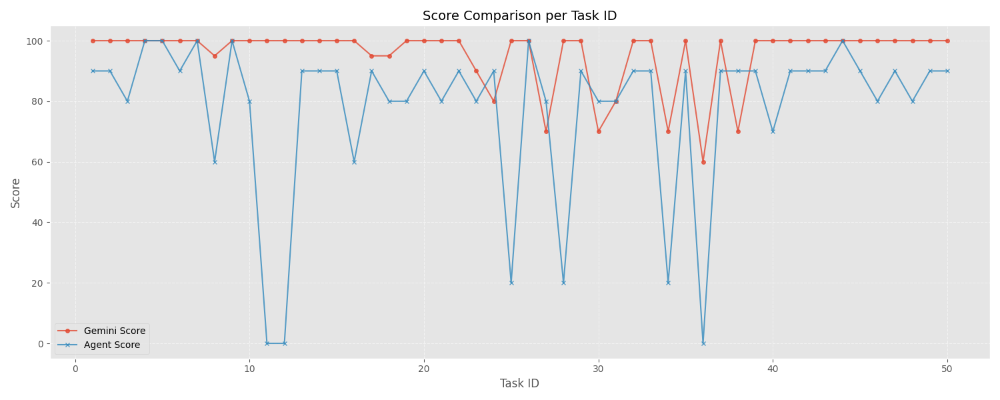
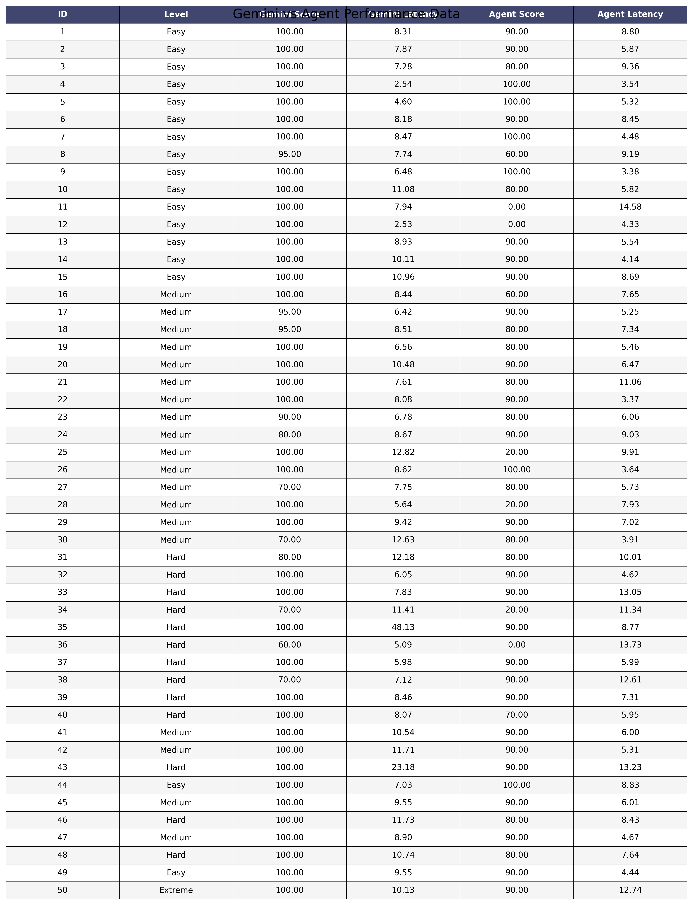

## GAME RECOMMENDATION AGENT

my lora [assignment](https://github.com/GoktugCanik/Qwen2.5-Lora-and-Benchmarking)

## Table of Contents
- [About Project](#about-project)
- [Project Objective and Motivation](#project-objective-and-motivation)
- [Data Acquisition and Structuring Strategy](#data-acquisition-and-structuring-strategy)
- [Local Model Experience and Technical Challenges](#local-model-experience-and-technical-challenges)
- [Logs From Thought Process](#logs-from-thought-process)
  - [Basic Example](#a-basic-example)
  - [More Complex Example](#a-more-complex-example)
  - [Even More Complex Example](#an-even-more-complex-example)
- [Benchmark](#benchmark)
- [Benchmark Evaluation](#benchmark-evaluation)
  - [Detailed Look On Benchmark Results](#a-more-detailed-look-on-benchmark-results)

## About Project	
This was assigned to me as a school project. The project’s backbone integrates a RAG (Retrieval-Augmented Generation) architecture with a ReAct (Reasoning + Acting) agent loop. The system is not just a text generator—it acts as a reasoning engine that can query external tools (APIs and local databases) to make informed decisions. 
Core Model: llama-3.1-8b-instant

Agent Workflow: Instead of answering directly, the model follows a Thought-Action-Observation loop.

Vector Database: A lightweight BoW (Bag of Words) vectorization system is used locally. Documents are normalized by word frequency, and Cosine Similarity identifies the most relevant chunk for a query.

Dynamic Retrieval: The system directs queries to the appropriate document folder (System, Similarity, or Lore), reducing search space and minimizing false positives.

Atomic Chunking: Data is split into game-specific files, with each data line (e.g., CPU, RAM) tagged by document name, ensuring full context retention.

Latency Optimization: Only the top-K highest-scoring chunks are considered during inference, reducing processing time.

External Tool Integration: The system fetches live data from the RAWG API, such as Metacritic scores, release dates, and platform info, supplementing static documents.

## Project Objective and Motivation
Traditional game recommendation systems typically generate outputs based on surface-level parameters such as genre and tags. However, this approach falls short in fully capturing the atmospheric depth, mechanical nuances, and unique player experiences 
offered by games. The primary motivation of this project is to overcome the "surface-level recommendation" barrier of existing AI systems by developing an intelligent game advisor agent that analyzes game lore, technical requirements, and gameplay dynamics. My goal is to provide users not just with what is "popular," but with results that are tailored (“tailor-made”) to their specific system specifications and experiential expectations.

## Data Acquisition and Structuring Strategy
The core data for the project was obtained via dynamic requests from the comprehensive game database RAWG API. The following strategies were applied in the data management phase:
•	Game Info: Detailed descriptions of each game were structured as separate .txt files to reduce complexity and narrow the focus of the RAG (Retrieval-Augmented Generation) engine.
•	System Requirements and Similarity Analysis: Initially, these data were consolidated into a single large file using various language models. However, during testing, it was observed that the large file structure created "Semantic Noise." Having thousands of lines of data in a single file caused irrelevant game data to mix during vector-based searches (Cosine Similarity), leading the model to select incorrect information as the "closest result."
•	Optimization: To overcome this issue, Python-based scripts were developed to split system requirements and similarity data into game-specific files (atomic chunking). This ensured that the model focused only on the technical documentation of the relevant game, improving accuracy.

## Local Model Experience and Technical Challenges
In the initial development phase, the Qwen2.5:7b-instruct-q4_K_M model running on local resources was used. The main challenges encountered and the solutions applied are as follows:
•	Language Instability (Multilingual Drift): The model was observed to switch nonsensically between Turkish, English, and Chinese, resulting in inconsistent responses.
•	Computational Capacity and Lore Retention: It was determined that 7B-parameter models have limited capacity for retaining complex story connections (lore), technical terminology and sometimes basic math. This limitation caused the model to produce answers without logical grounding or hallucinated responses outside the document.
•	Solution Approach: To overcome these constraints, I have moved to colab environment and used a more developed model.
•	Low scores on benchmark. No matter what i do benchmark score wouldn't go up 65%. I found the solution in benchmark questions. When i translated questions to english both my agents and Gemini's 	score increased. 
•	Wrong search parameters were another problem i have encountered. The agent would do calls with wrong names or sometimes extra words (such as Skyrim System Requirements instead of just Skyrim)
 	so i implemented a normalization function within the tools to strip redundant words and used prompt engineering to instruct the agent to output only atomic keywords. This ensures the search 		query matches the document titles perfectly, preventing "None" results caused by extra descriptive language.

## Logs From Thought Process:
A basic example:
ANALYSIS START:
Question:
Which platforms is Fallout: New Vegas available on, and what is its rating?
________________________________________
STEP 1
Thought: I will use the game_api_tool to find out which platforms Fallout: New Vegas is available on and its rating.
Action: game_api_tool: Fallout New Vegas
RUNNING: game_api_tool(Fallout New Vegas)
Observation: [LIVE DATA]
•	Game: Fallout: New Vegas
•	Release Date: 2010-10-19
•	Rating (0-5): 4.42
•	Metacritic Score: 84
•	Platforms: PC, Xbox One, PlayStation 4, Xbox 360, PlayStation 3
________________________________________
STEP 2
Thought: Sufficient information about Fallout: New Vegas’s platforms and rating has been obtained.
Action: Convey the information to the user.
Answer: Fallout: New Vegas is available on PC, Xbox One, PlayStation 4, Xbox 360, and PlayStation 3. The game’s rating is 4.42, and its Metacritic score is 84.
________________________________________
ANALYSIS COMPLETE
 

A more complex example:
ANALYSIS START:
Question:
Why is Terraria more 'RPG-focused' than Minecraft?
________________________________________
STEP 1
Thought: To argue why Terraria is more RPG-focused than Minecraft, we need to compare the two games based on RPG elements like character progression, loot systems, and combat mechanics. I will use the game_info_tool to gather information about Terraria’s gameplay.
Action: game_info_tool: Terraria
RUNNING: game_info_tool(Terraria)
Observation:
•	Terraria has many biomes and areas with unique visuals, resources, and enemies. Players can craft furniture, build settlements, and host NPCs that require protection. Three difficulty levels are available, with a large modding community.
•	Game Name: Terraria
•	Release Date: 2011-05-16
•	Genres: Action, Indie, Platformer
•	Tags: Singleplayer, Multiplayer, RPG, Co-op, Open World
•	Description: Terraria is a 2D action-adventure sandbox where players gather resources to craft stronger weapons and armor, explore procedural maps, and fight bosses.
________________________________________
STEP 2
Thought: Terraria contains several RPG elements, such as character progression, loot systems, and combat mechanics. Crafting stronger weapons and armor shows character development. Bosses and special events indicate challenge and accomplishment. Now, gather Minecraft’s gameplay information for comparison.
Action: game_info_tool: Minecraft
RUNNING: game_info_tool(Minecraft)
Observation:
•	Game Name: Minecraft
•	Release Date: 2009-05-10
•	Genres: Action, Simulation, Arcade, MMO, Indie
•	Tags: Multiplayer, Sandbox, Crafting, Building, Open World
•	Description: Minecraft is an open, procedurally generated 3D world focused on mining, building, and survival. Players craft tools, weapons, and armor. Various modes exist: Survival, Adventure, Hardcore, and Creative. Multiplayer allows shared worlds and PvP combat.
________________________________________
STEP 3
Thought: Both Terraria and Minecraft feature sandbox, crafting, and building mechanics. However, Terraria emphasizes character progression, loot systems, and combat mechanics, typical of RPGs. Bosses, events, and character development highlight its RPG focus. Minecraft focuses more on building, exploration, and survival, prioritizing creative freedom and multiplayer.
Action: game_similarity_tool: Terraria
RUNNING: game_similarity_tool(Terraria)
Observation:
•	Minecraft: Sandbox, Creativity, Survival — Building, crafting, exploration, survival.
•	Terraria: Sandbox, Adventure, Survival — Crafting, exploration, combat, building.
•	Stardew Valley: Farming Simulation, Life Simulation — Farming, crafting, relationships, exploration.
________________________________________
STEP 4
Thought: Terraria has a stronger focus on RPG elements. Minecraft emphasizes sandbox creativity and survival. Similarity tools show Terraria aligns with other RPG-focused games like Starbound and Don’t Starve.
Answer:
Terraria is more 'RPG-focused' than Minecraft due to its emphasis on character progression, loot systems, and combat mechanics. The game’s 2D action-adventure design, character creation, procedural maps, and boss battles reinforce this RPG focus. While Minecraft contains RPG elements, its design prioritizes sandbox creativity and survival over character development and storytelling, making Terraria a more RPG-centric experience.
________________________________________
ANALYSIS COMPLETE

An even more complex example:
ANALYSIS START:
Question:
Do DLSS 3.0 and Frame Generation technology really solve CPU bottlenecks in games like Cyberpunk 2077?
________________________________________
STEP 1
Thought: To answer whether DLSS 3.0 and Frame Generation technology solve CPU bottlenecks, we need to understand what they do. DLSS (Deep Learning Super Sampling) is an NVIDIA AI technology that improves graphics rendering performance. DLSS 3.0 includes Frame Generation, allowing the GPU to generate intermediate frames, potentially reducing CPU load. To assess their impact on CPU bottlenecks, we should look at system requirements and performance improvements in Cyberpunk 2077.
Action: system_requirement_tool: Cyberpunk 2077
RUNNING: system_requirement_tool(Cyberpunk 2077)
Observation:
•	GAME: Cyberpunk 2077
•	SYSTEM_RANK: High-End
•	OS: Windows 10
•	CPU_TYPE: Quad-core
•	RAM_MIN: 12 GB
•	GPU_MIN: GTX 1060
•	GPU_POWER_LEVEL: 6/10
•	OPTIMIZATION: Medium
•	NOTES: Demanding game with heavy GPU and CPU usage. 12GB RAM recommended for smoother performance.
________________________________________
STEP 2
Thought: Cyberpunk 2077 is demanding on both CPU and GPU. While system requirements show the general load, they don’t reveal how DLSS 3.0 and Frame Generation affect CPU bottlenecks. We need to consider how these technologies offload CPU workload in CPU-intensive games.
Action: game_api_tool: Cyberpunk 2077 NVIDIA DLSS 3.0
RUNNING: game_api_tool(Cyberpunk 2077 NVIDIA DLSS 3.0)
Observation:
•	Game: Cyberpunk 2077: Phantom Liberty
•	Release Date: 2023-09-26
•	Rating (0-5): 4.7
•	Platforms: PC, PlayStation 5, Xbox Series S/X
________________________________________
STEP 3
Thought: Information from the API provides general release and rating details but doesn’t explain CPU impact. DLSS 3.0 with Frame Generation reduces GPU rendering workload, which may indirectly ease some CPU bottlenecks. Direct impact depends on the game’s optimization and hardware configuration.
Action: game_info_tool: Cyberpunk 2077 Performance Enhancements
RUNNING: game_info_tool(Cyberpunk 2077 Performance Enhancements)
Observation:
•	Cyberpunk 2077 is a sci-fi RPG released on 2020-12-10.
•	Genres: Action, Shooter, RPG
•	Tags: Singleplayer, Atmospheric, RPG, Story Rich, Open World, First-Person, Sci-fi, FPS, Exploration
________________________________________
STEP 4
Thought: Observations provide general game info but don’t specify the impact of DLSS 3.0 and Frame Generation on CPU bottlenecks. Indirectly, these technologies reduce GPU workload and may alleviate some CPU-intensive tasks. Direct information is not available; conclusions rely on understanding the technologies.
Action: None
________________________________________
STEP 5
Thought: DLSS 3.0 and Frame Generation are designed to improve performance by offloading GPU workload and potentially reducing CPU-intensive tasks. Their effect on CPU bottlenecks depends on game optimization and hardware.
Answer: DLSS 3.0 and Frame Generation can indirectly mitigate CPU bottlenecks in games like Cyberpunk 2077 by reducing GPU workload and offloading some CPU tasks. However, they do not directly solve CPU bottlenecks, as their main purpose is enhancing GPU performance. The actual effect depends on how well the game utilizes these technologies and the hardware configuration. They contribute to smoother performance but are not a direct CPU solution.
________________________________________
ANALYSIS COMPLETE

## Benchmark 
The benchmark evaluates the agent’s performance on a curated set of game-related questions, focusing on accuracy and response latency. Each question is processed through the ReAct-based agent, which generates a structured answer using a “Thought → Action → Observation” loop.

To ensure objective evaluation, an LLM is used as a judge. The AI judge scores answers based on factual correctness, partial credit for partially correct responses, and understanding even when exact keywords are missing. The judge also considers effort when the agent admits it lacks information.

The benchmark records:
Accuracy Score (0–100) per question
Latency (seconds) per query

Results are compiled into a CSV report, showing individual question scores, average accuracy, and average latency. This setup allows precise evaluation of the agent’s strengths—structured knowledge retrieval and decision-making—as well as areas for improvement, particularly in handling lore-heavy or context-dependent questions.

## Benchmark Evaluation 
To evaluate the performance of my game adviser agent, I ran a controlled benchmark consisting of 50 curated game-related questions.

		Agent	Average Score	Average Latency (s)
			My Agent	77.8%	7.44
			Gemini AI	95.3%	9.35
		

	
	Gemini scores about %14 higher but my agent is %15 faster.

Observations:
•	Detail vs Conciseness: Gemini provides very detailed, often multi-paragraph answers, including explanations, examples, and related game suggestions. My agent produces shorter, concise answers that capture the main facts but omit 
extended details.

•	Accuracy: My agent scores between 80–100%, showing strong correctness despite brevity. Gemini achieves near-perfect coverage on all items due to its 
access to commercial-grade data.

•	Latency: My agent is generally faster per query, likely because it outputs short summaries, whereas Gemini takes longer to generate long, elaborate answers.

•	Comparison Approach: Using an LLM-as-judge allows nuanced scoring, accounting for partial correctness and reasoning quality rather than exact keyword matches.

## A More Detailed Look On Benchmark Results; 

Test Failures: ID 11 & ID 12
Some critical questions scored 0%, caused not by the model but by RAG retrieval and tool-data issues.

________________________________________
ID 11: Why is 8GB of RAM considered a 'bottleneck' in games today? - 0
Problem: Seeing  “games today” my agent tried to find modern games and mistakenly searched for general AAA games instead of reasoning about RAM as a bottleneck. It searched “AAA games”  as a game title both in database and sent a request to api despite I have forbid it in prompt. 
Agent did see Cyberpunk 2077 requires 12GB RAM, but failed to synthesize this into a general statement that 8GB is insufficient.

________________________________________
ID 12: PC release year of Ghost of Tsushima - 0
Problem: The api tool returned the initial console release date (2020-07-17) and didn’t have a pc release data.  Agent couldn’t make a difference between PC release and Console release so it answered wrongly. 

________________________________________
ID 36: Game studios with multiple 90+ Metacritic games (last 5 years) – 0
Problem: Without a tool for to search for game studios, The game_api_tool called repeatedly and returned irrelevant data. The agent could not reliably identify studios with multiple 90+ Metacritic games in the last 5 years and had to rely on partial internal knowledge, leading to an incorrect answer. (Internal knowledge was outdated) 
________________________________________

ID 25: S.T.A.L.K.E.R. 2 vs First Game System Requirements – 20
Question: Explain the technological difference between the announced system requirements of S.T.A.L.K.E.R. 2 and the first S.T.A.L.K.E.R. game.
Issue Summary:
Tool Failures: Both system_requirement_tool and game_info_tool returned irrelevant results (Mirror’s Edge, Bioshock 2, etc.) instead of the requested games because of lack of data in database.
Api call returned S.T.A.L.K.E.R info but exact system requirements for S.T.A.L.K.E.R. 2 were unavailable in the tools probably because it is a new game.
Agent Limitation: The model had to rely on internal knowledge and inference, not concrete tool data.
My agent correctly thought  that S.T.A.L.K.E.R. 2 requires much more powerful hardware than the 2007 original due to modern graphics, engines, and gameplay mechanics.
Score: 20% – the answer was conceptually correct but lacked tool-supported evidence, leading to a low score.
________________________________________

ID 24: Top 3 open-world games on Steam Deck 
80 for Gemini | 90 for Agent
Analysis: The agent successfully identified three highly-rated, PC-compatible open-world games—Horizon Zero Dawn, The Witcher 3, and Elden Ring—likely to run smoothly on the Steam Deck. Probably the reason why is because I explicitly stated in prompt 
 “- **Steam Deck:** If asked do api call for games and try to find games that are on steam. Don't do the call with the name 'STEAM'.”
And the agent got lucky.
________________________________________

